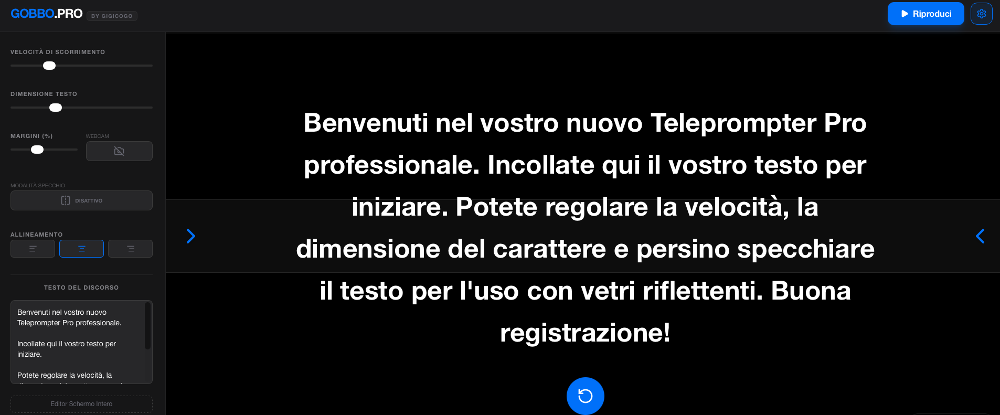

# Gobbo Pro by Gigicogo

Gobbo Pro è un teleprompter web pensato per creator, formatori e professionisti che hanno bisogno di leggere un testo mentre si registrano con la webcam.

## Demo live

Prova l’app online su Vercel: [Apri Gobbo Pro](https://gobbo-pro-by-gigicogo.vercel.app)

L’app permette di far scorrere un testo sullo schermo e di personalizzare alcuni parametri fondamentali per la lettura, come dimensione del testo, colore e velocità di scorrimento. Inoltre consente di vedersi mentre il testo scorre, così da migliorare postura, sguardo in camera e gestione della registrazione.

## Screenshot



## Cosa fa

Con Gobbo Pro puoi:

- incollare o scrivere un testo da leggere;
- farlo scorrere come un teleprompter;
- aumentare o diminuire la dimensione del testo;
- cambiare il colore del testo;
- regolare la velocità di scorrimento;
- visualizzare la tua webcam mentre leggi.

## Perché può essere utile

Questa app è pensata per chi registra:

- video per YouTube;
- lezioni o videocorsi;
- reel o contenuti social;
- presentazioni o speech davanti alla webcam.

L’obiettivo è rendere la lettura più fluida e naturale, senza dover distogliere troppo lo sguardo dal punto di ripresa.

## Funzioni principali

- **Testo personalizzabile** – puoi adattare la leggibilità del copione in base alla distanza dallo schermo.
- **Velocità regolabile** – puoi scegliere il ritmo di scorrimento più adatto al tuo modo di parlare.
- **Colore del testo** – utile per migliorare contrasto e comfort visivo.
- **Anteprima webcam** – puoi controllare in tempo reale la tua inquadratura mentre leggi.

## Tecnologie usate

Il progetto è realizzato come web app con stack moderno frontend. Nel repository sono presenti file tipici di un progetto basato su Vite e TypeScript, come `src/`, `package.json` e `vite.config.ts`.[page:1]

## Come avviare il progetto in locale

### Requisiti

- Node.js installato
- npm installato

### Installazione

```bash
git clone https://github.com/gigicogo/Gobbo-Pro-by-Gigicogo.git
cd Gobbo-Pro-by-Gigicogo
npm install
```

### Avvio

```bash
npm run dev
```

Dopo l’avvio, apri nel browser l’indirizzo locale mostrato nel terminale.

## Note

Per usare correttamente la webcam, il browser potrebbe chiedere l’autorizzazione all’accesso video.  
Se nel progetto sono previste integrazioni aggiuntive tramite variabili ambiente, controlla anche eventuali istruzioni presenti nei file di configurazione del repository.

## A chi è dedicato

Gobbo Pro è pensato soprattutto per:

- content creator;
- docenti e formatori;
- professionisti che registrano video;
- chi vuole un teleprompter semplice da usare direttamente nel browser.

## Stato del progetto

Progetto personale sviluppato per semplificare la registrazione di contenuti video e migliorare la lettura in camera.

---

Se ti occupi di AI generativa, contenuti e formazione, puoi trovare altri progetti e risorse anche nel resto del mio profilo GitHub.
